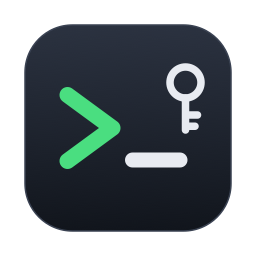

<p align="center"></p>

# SSHManager

**Menü çubuğundan tek tıkla SSH: macOS'un kendi Terminal'inde, parola yazmadan.**

Sunucularını menü çubuğuna ekle; tıklayınca bağlantı Terminal'de (ya da iTerm2'de) açılır. Parolalar macOS
Anahtar Zinciri'nde güvenle saklanır ve **terminale hiçbir zaman yazılmaz**: ssh parolayı doğrudan SSHManager'dan
ister (`SSH_ASKPASS`). "Dandik SSH uygulamaları" yerine sevdiğin terminali kullanmaya devam edersin.

## Neler yapar?

- **Tek tıkla bağlan.** Menü çubuğundaki simgeden sunucuyu seç; Terminal'de yeni sekmede açılır.
- **Parola terminale yazılmaz.** Parola Anahtar Zinciri'nden gelir; ekranda, kabuk geçmişinde ya da panoda görünmez.
  Yanlışsa native bir pencere doğrusunu sorar ve istersen kaydeder.
- **Touch ID ile bağlan** (isteğe bağlı). Kayıtlı parola kullanılmadan önce parmak izi sorulur.
- **Parolasız girişe geç.** Tek tıkla SSH anahtarın sunucuya yüklenir; sonrası parolasız. `scp`, `git`, `mc` da parolasız çalışır.
- **Hızlı bağlan: ⌃⌥S.** Spotlight gibi arama kutusu; birkaç harf yaz, Enter.
- **Terminalden `sshm`.** `sshm web` bağlanır, `sshm web 'df -h'` komut çalıştırır, `sshm` listeyi gösterir. Sekme tamamlama dahil.
- **Dosyalar (Midnight Commander).** Solda Mac'in, sağda sunucu; dosyaları iki panel arasında taşı.
- **Tüneller.** Sunucudaki veritabanını `localhost:5433`'e bağla; menüden aç/kapat.
- **Renkli terminal.** Canlı sunucular kırmızı, test sunucuları yeşil açılsın; yanlış sunucuda komut çalıştırma riski azalır.
- **Kopsa da devam (tmux).** Bağlantı koparsa kaldığın oturuma geri dönersin.
- **`~/.ssh/config`'ten içe aktar.** Mevcut sunucuların tek tıkla gelir.
- **Raycast / Alfred / Kestirmeler:** `sshmanager://connect/web`, `sshmanager://files/web`, `sshmanager://quick`.

## Kurulum

Gerekenler: **macOS 13+** ve Swift (Xcode ya da `xcode-select --install`).

```bash
git clone https://github.com/benysff/ssh-manager.git
cd ssh-manager
./kur.command
```

Uygulama derlenir (Apple Silicon + Intel), **Uygulamalar** klasörüne kurulur ve menü çubuğunda belirir.
İlk bağlantıda macOS iki izin sorar:

- **Terminal'i kontrol etme (Otomasyon):** bağlantıyı Terminal'de açmak için.
- **Erişilebilirlik:** Terminal'de yeni *sekme* açmak için. Vermezsen her bağlantı yeni pencerede açılır.

Terminalden `sshm` komutunu kullanmak için menüden **Ayarlar → Terminal komutunu kur (sshm)**.

## Güvenlik

- Parolalar yalnızca macOS **Anahtar Zinciri**'nde durur (`com.yusuf.sshmanager` servisi, sadece bu cihaz).
  Sunucu listesi `~/Library/Application Support/SSHManager/servers.json` dosyasındadır ve parola içermez.
- Parola ssh'a `SSH_ASKPASS` üzerinden, doğrudan ve sadece istendiğinde verilir; terminale yazılmaz.
- İlk bağlantıda sunucunun parmak izi native bir pencerede gösterilir ve onayın istenir.
- Anahtar Zinciri erişimi uygulamanın imzasına bağlıdır. Uygulamayı kaynaktan her yeniden derlediğinde macOS
  kayıtlı parolalar için bir kez "izin ver" sorabilir; **Her Zaman İzin Ver** demen yeterli.

## Nasıl çalışır?

Aynı program dört rolde çalışır: menü çubuğu uygulaması, `sshm` komutu, ssh'ın parola sorduğu yardımcı
(`SSH_ASKPASS`) ve Midnight Commander için küçük bir ssh ara katmanı. Terminale sadece
`SSHManager connect <sunucu>` gibi kısa bir komut gönderilir; o da bağlantıyı `ssh` ile kurar.

| Klasör | Ne var |
|---|---|
| `Sources/SSHManagerKit` | Sunucu modeli, ssh komutu oluşturma, `~/.ssh/config` okuma, Anahtar Zinciri (test edilebilir çekirdek) |
| `Sources/SSHManager` | Menü çubuğu, terminal açıcı, askpass, `sshm`, tüneller, hızlı bağlan, anahtar kurulumu |
| `Tests` | Birim testleri (`swift test`) |

## Lisans

[MIT](LICENSE)

---

### English

SSHManager is a macOS menu bar app that opens SSH connections in the native Terminal (or iTerm2) with one click.
Passwords live in the macOS Keychain and are handed to `ssh` through `SSH_ASKPASS`, so they are never typed into
the terminal. It also offers Touch ID, one-click SSH key setup, a quick-connect palette (⌃⌥S), an `sshm` CLI,
Midnight Commander file browsing, port-forwarding tunnels, colored terminals for production servers, tmux resume
and `~/.ssh/config` import. The UI is in Turkish. Install with `./kur.command` (macOS 13+, Swift required).
